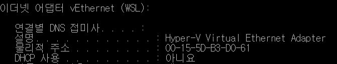
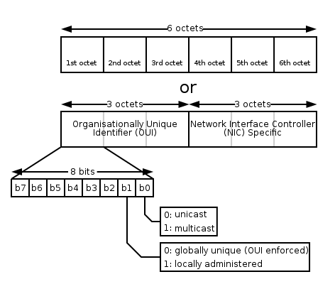
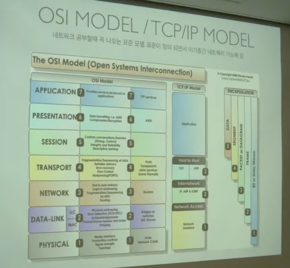
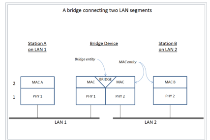
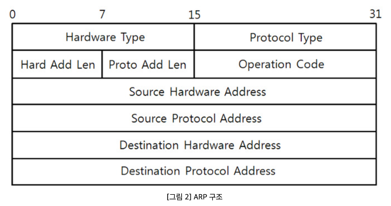
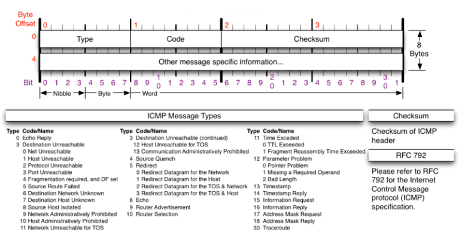
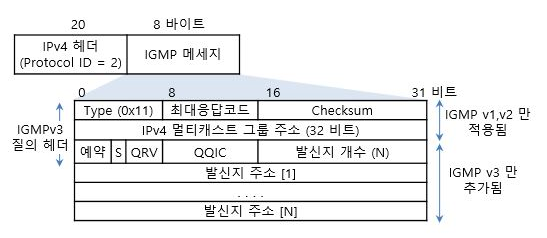

# Chapter01 Practice Problems

[Q01](#Q01)  
[Q02](#Q02)  
[Q03](#Q03)  
[Q04](#Q04)  
[Q05](#Q05)  
[Q06](#Q06)  
[Q07](#Q07)  
[Q08](#Q08)  

## Q01

### Q
  
이더넷의 48비트 물리 주소의 비트 단위 구조를 조사하고, 자신의 PC에서 사용 중인 이더넷 주소를 분석하시오.  
  
### A  
  
주소 결정 프로토콜(Address Resolution Protocol, ARP)은 네트워크 상에서 IP주소를 물리적 네트워크 주소로 대응시키기 위해 사용 되는 프로토콜이다. 여기서 물리적 네트워크 주소는 이더넷 또는 토큰링의 48비트 네트워크 카드 주소를 뜻한다. 이 물리적 주소는 바뀌지 않는다.  

내 컴퓨터의 물리적 주소는 다음과 같다.  
  

  
48비트는 총 6개의 octet으로 구성되어있고, 1개의 octet은 8비트이다. (8*6 = 48)  
이 안에서 이 주소가 전역적으로 관리되는 주소인지, 지역적으로 관리되는 주소인지 확인할 수 있는데, 첫 옥텟의 두 번째로 작은 비트값을 설정함으로써 구별될 수 있으며 이 값이 0이면 전역, 1이면 지역이다.  
  
  
  
내 주소의 1번 옥텟은 00(0)이고, 이를 2진수화하면 00000000이다. 이는 내 물리주소가 전역주소이면서 동시에 unicast임을 알 수 있다.  
unicast인 경우 하나의 네트워크 카드에만 수/송신 한다.  

## Q02

### Q

OSI(Open Systems Interconnection) 7계층 모델에 관해 조사하고, 각 계층의 기능을 TCP/IP 프로토콜 관점에서 기술하시오.  

### A

OSI(Open Systems Interconnection) model: 시스템의 기본 내부 기술 및 특정 프로토콜 제품군에 관계없이 통신 시스템 또는 컴퓨팅 시스템의 통신 기능에 대한 보편적 표준을 설명하는 개념적 모델  
 - 계층 1: 물리계층
 - 계층 2: 데이터 링크 계층
 - 계층 3: 네트워크 계층
 - 계층 4: 전송 계층
 - 계층 5: 세션 계층
 - 계층 6: 표현 계층
 - 계층 7: 응용 계층

1. 물리계층
   - 제일 낮은 모델. 하드웨어적인 부분을 담당 (LAN, 어댑터, 허브, 모뎀 등등...)
   - 물리계층이 연결되어있지 않으면 의미가 없다.

2. 데이터 링크 계층
    - Point to Point 간 신뢰성 있는 전송을 보장하기 위한 계층
    - 이 계층에서 Q01에서 다룬 물리 주소를 사용한다.

3. 네트워크 계층
    - 여러 개의 노드를 거칠 때마다 경로를 찾고, 다양한 길이의 데이터를 전달
    - 라우터와 스위치가 이 계층에서 동작
    - IP가 이 계층에서 사용됨

4. 전송 계층
    - End to End의 사용자들이 신뢰성 있는 데이터를 주고 받을 수 있도록 해줌
    - TCP, UDP와 같은 통신 프로토콜들이 이 계층에서 사용됨

5. 세션 계층
    - 양 끝단의 응용 프로세스가 통신을 관리하기 위한 방법을 제공
    - 운영체제에서 관리한다.

6. 표현 계층
    - 코드 간의 번역을 담당하며 사용자 시스템에서 데이터의 형식상 차이를 다루는 부담을 응용 계층이 하지 않게 일을 덜어준다.
    - 인코딩, 암호화 등 담당

7. 응용 계층
    - 프로세스와 직접 관계하여 사용됨
    - 사용자 입출력(I/O), 네트워크 소프트웨어 UI 등에 사용됨
    - HTTP가 존재하는 계층

각 계층의 기능을 TCP/IP 프로토콜 관점에서 보면 **1-2 계층이 네트워크 접근계층, 3-4 계층은 각각 인터넷 계층, 전송 계층과 1:1로 맞댕응하고 5-7계층이 응용 계층**으로 묶이게 된다.  

## Q03

### Q

다음은 TCP/IP와 연관된 대표적인 네트워크 연결 장치이다. 각각의 기능을 조사하시오.  

### A

1. 리피터 (repeater)
    -  **물리계층**에서 동작하는 장비
    - 근거리 통신망을 구성하는 세그먼트를 확장 혹은 연결시 사용
    - 신호를 수신하여 **신호를 증폭**한 후, 다음 구간으로 재전송    
    - **여러대의 리피터를 사용하여 신호를 먼 거리까지 전달하는 것이 가능**
    
2. 허브 (hub) 
    - **물리계층**에서 동작하는 장비 
    - 다수의 pc와 장치를 묶어 LAN을 구성할 때 각 PC를 모으는 장치이며 단순하게 보면 리피터가 다중으로 있는 개념이다.
    - 단순 중계기 역할로, 가령 컴퓨터 B가 C로 신호를 보낼 때 일단 모든 컴퓨터에게 전송한다. 즉, 모든 신호를 Broadcast한다.
    - 더미 허브, 스위칭허브, 인텔리전트 허브가 있다.
        - **더미 허브**는 말 그대로 컴퓨터간 연결을 시켜준다. 단점은 데이터를 모든 컴퓨터로 전달하기에 허브에 연결된 다른 컴퓨터들은 이 데이터 전송이 끝날 때까지 기다려야해서 네트워크 속도가 떨어진다.
        - **스위칭 허브**는 더미 허브의 개선판으로 모든 데이터를 모든 컴퓨터에 전송하지 않고, 순간순간 포트를 스위칭하여 목적지에만 전달한다. 그렇기 때문에 각 포트마다 전용할당이 가능하고 속도가 떨어지지 않는다.
        - **인텔리전트 허브**는 더미허브에 네트워크 관리시스템(NMS)가 추가 된 허브이다. 망 관리 기능이 있으며, 어떤 pc에 문제가 생기면 그 pc와 연결된 포트를 찾아 방출시키는 기능이 있다.
    
3. 브리지 (bridge) 
    - **데이터 링크 계층**에서 동작한다.
    - 2개의 LAN을 연결할 때 사용되며 들어오는 패킷을 분석하여 다른 곳으로 보다 효율적으로 보내준다.
    
      
    
4. 라우터 (router) 
    - **네트워크 계층**에서 동작한다.
    - 컴퓨터간 데이터 패킷을 전송하는 네트워크 장치이다.
    - 다른 네트워크 간 중계역할을 해주고, 연결된 경로를 따라 데이터 패킷을 다음 장치로 전달해준다. 이 때 **굉장히 효율적인 경로를 통해 패킷을 전달**한다.
    
5. IP 공유기 (IP sharing device)
    - 라우터의 NAT기능과 게이트웨이, 허브 및 네트워크 관리 도구를 통합하여 나온 물건이다.
    - 한 개의 IP만 사용하여 여러 대의 컴퓨터나 기기들이 인터넷에 접속할 수 있도록 해주는 장치

## Q03

### Q

RFC (Request For Comments)에 관해 조사하시오. RFC 문서 검색 서비스를 제공하는 웹사이트를 찾아서 IP, TCP, UDP 프로토콜 명세를 담고 있는 RFC 번호를 알아내시오.  

### A

직역하자면 ‘비평을 기다리는 문서’로, 인터넷 기술에 적용 가능한 새로운 연구, 혁신, 기법 등을 아우르는 메모를 나타낸다.  
  
인터넷 협회에서 기술자 및 컴퓨터 과학자들이 RFC 메모의 형태로 출판하게 되고, 새로운 생각이나 정보에 대한 이야기를 나누고싶거나, 생각 자체를 단순히 전달하는 용도로 출판된다.  
  
인터넷국제표준화기구는 일부 RFC를 인터넷 표준으로 받아들이기도 한다. 각 문서는 일련번호가 있고, 일련번호를 부여받고 출판되면 폐지되거나 수정되지 않는다.  

IP, TCP, UDP 프로토콜 RFC 번호
 - IP: 791
 - TCP: 793
 - UDP: 768

## Q05

### Q

다음은 IPv4의 주소 종류를 나열한 것이다. 각 주소의 역할과 비트 단위 구조를 조사하시오.

### A

1. 유니캐스트 (unicast)
    - 고유 주소로 식별된 하나의 네트워크 목적지에 1:1로 트래픽 혹은 메세지, 데이터를 전송하는 방식을 말한다.
    
2. 멀티캐스트 (multicast) 
    - 한 번의 송신으로 메세지나 정보를 목표한 여러 컴퓨터에 동시에 전송하는 것을 말한다.
    
3. 애니캐스트 (anycast)
    - 애니캐스트, 혹은 임의캐스트는 여러 개의 노드들에 데이터를 전송할 수 있고, 이 노드들은 모두 동일한 목적 주소로 식별된다.

IPv4 구조

  

총 20바이트로 이루어져 있으며 IP Option이 붙을 수도 있고 아닐 수도 있다. 만약 붙으면 4바이트씩 붙으며 최대 10개의 옵션이 붙을 수 있어서 만약 붙으면 IPv4는 최대 60바이트까지 가능하다.(IPv4: 20~60바이트) 일반적으로는 옵션 없이 사용된다.

 - 버전: IP 프로토콜의 버전(1바이트)이다. 4와 6이 가능한데 4가 온다고 생각하면 된다.(IPv6는 모양이 다르기 때문에 IPv4만 가능하다고 보면 된다.)
 - Header Length(1바이트): 4bit이므로 최대 15까지 가능하다. 실제로 사용헤더의 길이는 20~60까지 가능하기 때문에 여기에는 '나누기 4'를 해서 저장하게 된다. 즉, 20/4 = 5 ~ 60/4 = 15이며, 따라서 일반적으로는 5가 온다고 생각하면 된다.
 - TOS(Type of Service): 예전에 쓰였으나 현재는 쓰이지 않아 0으로 비워둔다.
 - Total Length: 헤더의 길이 + 페이로드의 길이이다. 상위 계층에서부터 encapsulation 되어 내려온 데이터의 길이와 합친 전체의 길이를 뜻한다.
 - Identification + IP Flags + Fragment Offset: 데이터가 큰 것을 보낼 때 최대 전송 단위가 있기 때문에 잘게 잘라서 보내는데, 이 때 사용되는 값들이다. 즉, 쪼개진 값들을 알아볼 수 있게 하는 것들이다.
    - Identification: 쪼개져서 온 데이터를 받는 쪽에서는 쪼개서 온 데이터를 합쳐야 하는데 그러려면 쪼개져 전달되어 온 패킷들이 원래는 하나였다는 것을 알아볼 수 있어야 한다. 따라서 각 패킷에 id를 똑같이 준다. 그러면 같은 id를 가진 것들만 다시 합칠 때 사용하게 되는 것이다.
    - IP Flags: 3비트(x D M)로 이루어져 있으며 첫 번째 것(x)은 안쓰고 두 번째 것(D)은 'Don't fragmentation'을 의미하며 세 번 째 것(M)은 'More fragmentation'을 의미한다. 
        - D: 데이터를 보내는 사람이 데이터를 '쪼개서 보내지 않겠다'고 명시하는 것인데, 이렇게 지정하면 전송이 안된다... 따라서 거의 쓰지 않는다.
        -  M: 조각화 하여 보낼 때 첫 번째 패킷 뒤에 나 말고 다른 패킷이 더 있다고 상대방에게 알려주는 역할을 한다. 따라서, 최대 전송 단위 1500보다 큰 데이터가 전송되면 무조건 M이 1로 세팅된다.(조각화가 안됐으면 0)
    - Fragment Offset: 잘게 쪼갠 데이터를 복구하려면 데이터의 순서가 있는데, 전송은 1->2->3 순서대로 하더라도 받는 쪽에서는 다른 데이터도 받으니 순서가 꼬일 수 있다. 따라서 순서를 알아볼 수 있게 Offset을 지정한다. 이는 어느 기준으로부터 얼만큼 떨어져 있는 지를 의미한다. 즉, '시작부분'으로부터 얼만큼 떨어져 있는 지를 의미한다. 그러면 받는 쪽에서는 offset 값을 확인해 원래대로 데이터를 만들 수 있게 된다.
 - Time To Live(TTL): 패킷이 살아있을 수 있는 시간이다. 패킷의 이동 경로가 잘못 되어 데이터가 잘 전달되지 않을 수 있다. 그러면 패킷이 사라져야 한다. 또한 3계층 장비(라우터)를 하나 넘어갈 때마다 1씩 줄어들게 된다. 0이 되는 순간 네트워크 장비는 해당 패킷을 다른 사람에게 전달하지 않고 버린다. 운영체제마다 설정하는 값이 다르다.(윈도우는 128, 리눅스는 64)
 - 프로토콜: 상위 프로토콜이 뭔지 알려준다. IP 프로토콜 입장에서 상위 프로토콜로 올 수 있는 것에는 ICMP(3계층-> 01로 세팅됨(10진수는 1)), TCP(4계층->06으로 세팅됨(10진수는 6)), UDP(4계층->11로 세팅됨(10진수는 17))
 - Header Checksum: 헤더에 오류가 있는지 없는지 확인하는 값이다. 헤더의 여러 필드들을 이용해 값을 계산한 뒤 Header Checksum에 넣어서 패킷을 보내는데, 받는 쪽에서는 본인이 계산한 것과 Header Checksum의 값이 일치하는 지를 비교해 본다.
 - 출발지 IP 주소(source): 4바이트
 - 목적지 IP 주소(Destination): 4바이트
  
IPv4의 비트 단위는 총 32비트로 8비트를 8진수로 표현하여 4자리로 나타낸다.  
  
## Q06

### Q

다음은 IPv6의 주소 종류를 나열한 것이다. 각 주소의 역할과 비트 단위 구조를 조사하시오.

### A

1. 유니캐스트 (unicast)
    - 고유 주소로 식별된 하나의 네트워크 목적지에 1:1로 트래픽 혹은 메세지, 데이터를 전송하는 방식을 말한다.
    
2. 멀티캐스트 (multicast) 
    - 한 번의 송신으로 메세지나 정보를 목표한 여러 컴퓨터에 동시에 전송하는 것을 말한다.
    
3. 애니캐스트 (anycast)
    - 애니캐스트, 혹은 임의캐스트는 여러 개의 노드들에 데이터를 전송할 수 있고, 이 노드들은 모두 동일한 목적 주소로 식별된다.
  
IPv6의 비트 단위는 총 128비트이며 16비트를 16진수로 표현하여 8자리로 나타낸다.  
  
## Q07

### Q

다음은 TCP/IP와 연관된 프로토콜이다. 각 프로토콜의 역할과 특징을 조사하시오.

### A

1. ARP(Address Resolution Protocol, 주소 결정 프로토콜)
    - 같은 네트워크 대역에서 통신을 하기 위해 필요한 MAC 주소를 IP 주소를 이용해서 알아내는 프로토콜이다. 따라서 IP 주소만 입력해도 ARP 프로토콜이 상대방의 MAC 주소를 알아오고, 같은 네트워크 대역에서 MAC 주소를 이용해 통신을 하게 된다.
    - 28비트이며 구조에 따라 다음과 같이 동작한다.

          
  
        - 하드웨어 타입: 2계층에서 사용하는 프로토콜의 타입이다. 16진수로 0001이 오며 이는 이더넷을 뜻한다.(2계층은 거의 이더넷만 온다고 보면 된다.)
        - 프로토콜 타입: IPv4 프로토콜의 타입인 0800이 온다.
        - Hardward Address Length: 맥주소를 의미하며 맥주소의 길이 6byte가 온다. 06이 들어간다.
        - Protocol Address Length: IPv4 길이가 들어가며 4byte이고 04가 들어간다.
        - Opcode(Operation code): 어떻게 동작하는 지를 나타내는 코드 값인데 2개 밖에 없다. ARP 프로토콜은 IP 주소를 입력하면 상대방의 MAC 주소를 알아오는 프로토콜이다. 즉, 요청하고 있는지 응답하고 있는 지를 나타낸다. 따라서, 1로 보내면 상대방은 2로 작성해서 보내게 된다. 그러므로 1은 요청, 2는 응답이 되는 것이다.
        - 출발지의 MAC 주소: 6바이트👉 여기서 주의할 것은, 이더넷만 다른 프로토콜과는 다르게 '목적지의 MAC주소'가 먼저 온다는 것이다. 일반적으로는 출발지의 MAC 주소가 먼저 온다.
        - Source Protocol Address(IPv4): 4바이트
        - 목적지의 MAC 주소 : 6바이트
        - Source Protocol Address(IPv4)(4바이트)

2. ICMP(Internet Control Message Protocol, 인터넷 제어 메세지 프로토콜)
    - 네트워크 컴퓨터 위에서 돌아가는 운영체제에서 오류 메시지(Requested service is not available 등)를 전송받는 데 주로 쓰이며 인터넷 프로토콜의 주요 구성원 중 하나로 인터넷 프로토콜에 의존하여 작업을 수행한다. 
    - 8byte로 다음과 같은 구조로 이루어져 있다.
    
          

        - Type: 카테고리
          1. 0, 8: 8번이 요청이고 0번이 응답이다. 즉, 통신확인 요청할 때 8번, 이에 응답할 때 상대방이 0번으로 보내준다.
          2. 3, 11: 3번은 "Destinatioin Unreachable" 즉, 가는 경로상의 문제가 있는 것이며(라우터 경로 설정이 잘못 되었을 때), 11번은 "Time exceeded"(요청 시간 만료) 즉, 목적지까지 갔으나 응답을 못하는 것이다.(상대방 방화벽이 켜져있을 때)
          3. 5: 옛날에 사용하던 것으로 원격지에 있는 상대방의 라우팅 테이블을 ICMP로 수정할 때 사용한다. 남의 것을 수정할 수 있기 때문에 보안상 문제가 생겨서 요새는 잘 사용되지 않는다.
        - Code: 해당 카테고리의 소분류
        - Checksum: IPv4에서와 동일하게 헤더에 오류가 있는지 확인하기 위해 사용된다.

3. IGMP(Internet Group Management Protocol, 인터넷 그룹 관리 프로토콜)
   
      

    - 인터넷에서 IPTV 와 같은 멀티캐스트 실시간 전송을 위해서 사용하는 프로토콜이다.
    -  IPTV에 쓰이는 핵심적인 프로토콜이지만, 그 외에는 잘 사용하지 않고 있다.

## Q08

### Q

윈도우 비스타/7에서는 초기 설치 상태에서 텔넷 클라이언트를 사용할 수 없다. 텔넷 프로토콜의 문제점을 보안(security) 관점에서 설명하시오

### A

Telnet은 보통 데이터를 암호화하지 않고, 평문으로 송수신하기 때문에 패킷 캡쳐 증을 통해 통신 내용을 도난당할 위험이 높다.

즉, 통신에 안전성이 낮으며, ssl을 이용해 암호화하는 것이 가능하나 현재는 보다 편리하고 안전성이 높은 SSH가 존재하기 때문에 굳이 Telnet을 사용하지는 않는다.
